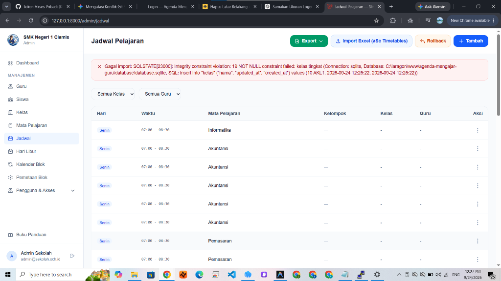

<p align="center">
  
</p>

<h1 align="center">SOPAN — Agenda Mengajar Guru</h1>

<p align="center">
  <strong>Sistem Operasional Presensi & Agenda Mengajar Guru Terintegrasi</strong><br>
  SMK Negeri 1 Ciamis
</p>

<p align="center">
  
  
  
  
  
</p>

---

## 📖 Tentang Aplikasi

**SOPAN (Sistem Operasional Presensi & Agenda Mengajar Guru)** adalah aplikasi manajemen kegiatan belajar mengajar (KBM) dan monitoring kehadiran guru serta siswa secara *real-time*. Dikembangkan khusus untuk memenuhi kebutuhan operasional sekolah modern—khususnya SMK dengan sistem pembelajaran Reguler maupun **Sistem Blok** (rotasi mingguan/harian kelompok A/B).

Aplikasi ini mendigitalkan seluruh alur pencatatan KBM: mulai dari pelaporan foto bukti kehadiran masuk & keluar (*check-in / check-out*) oleh perwakilan siswa, pencatatan materi & tugas oleh guru pengajar, monitoring kelas kosong oleh petugas piket, kontrol akun oleh wali kelas, hingga rekapitulasi data kehadiran untuk Tata Usaha dan Kepala Sekolah.

---

## ✨ Fitur Unggulan

### 1. 📸 Presensi KBM & Bukti Foto Cerdas
* **Dual Capture (Masuk & Keluar)**: Bukti foto kehadiran guru saat jam pelajaran dimulai dan saat berakhir (*check-out*).
* **Kompresi Otomatis di Browser**: Foto beresolusi tinggi (kamera ponsel 48MP/108MP) secara instan dikompresi di sisi *client* menggunakan akselerasi GPU `createImageBitmap` menjadi file JPEG ringan (< 300KB) sebelum diunggah, menghemat kuota dan mempercepat pengiriman di jaringan seluler.
* **Kompatibilitas Penuh iOS & Android**: Dioptimalkan untuk Safari iOS dan browser Android tanpa kendala keterbatasan memori canvas.

### 2. ⏱️ Aturan Toleransi Keterlambatan Dinamis
* **Diferensiasi Toleransi**: Konfigurasi toleransi berbeda antara **Jam Pertama (default 10 menit)** dan **Jam Lanjutan / pergantian mapel (default 15 menit)**.
* **Kunci Status Terlambat Otomatis**: Tombol status terlambat dinonaktifkan secara otomatis selama KBM masih berada dalam rentang toleransi waktu.

### 3. 🏫 Dukungan Sistem Jadwal Reguler & Blok SMK
* **Sistem Blok Mingguan & Harian**: Mendukung pembagian jadwal blok dan kelompok belajar (Kelompok A / B / Reguler) untuk program SMK Pusat Keunggulan.
* **Kalender Blok Terpusat**: Pengaturan rotasi blok terintegrasi per semester dan tahun ajaran aktif.

### 4. 📊 Dashboard Publik Interaktif
* **Real-time Class Status**: Menampilkan status seluruh kelas pada jam pelajaran yang sedang berlangsung (Guru Hadir, Terlambat, Mengajar, Digantikan, atau Kelas Kosong).
* **Statistik Visual**: Grafik diagram lingkaran persentase kehadiran guru dan siswa per hari serta rekapitulasi 7 hari terakhir menggunakan Chart.js.

### 5. 🛡️ Multi-Role & Kontrol Akses Fleksibel
* **Wali Kelas**: Dapat memantau kehadiran siswa di kelasnya serta mengaktifkan/menonaktifkan siswa yang berhak melakukan absensi kelas (*security guard*).
* **Guru Tambahan**: Antarmuka khusus untuk peran Guru BK dan Ketua Program Keahlian (Kaprog).
* **Petugas Piket**: Mengawasi kelas secara langsung, mengirim teguran untuk guru yang belum hadir, dan mendata guru pengganti.
* **Tata Usaha & Kepala Sekolah**: Rekapitulasi kehadiran menyeluruh dengan ekspor laporan ke format **PDF** dan **Excel (.xlsx)**.

### 6. 📱 Dukungan Progressive Web App (PWA)
* Aplikasi dapat diinstal langsung ke layar utama (*Add to Home Screen*) perangkat ponsel cerdas layaknya aplikasi native melalui Service Worker yang terintegrasi.

---

## 👥 Peran Pengguna (Roles)

| Role | Deskripsi & Hak Akses |
|---|---|
| **Super Admin** | Konfigurasi sistem global (toleransi waktu, identitas sekolah, tahun ajaran/semester), manajemen role & permission Spatie, serta akses seluruh modul. |
| **Admin** | Manajemen master data: Guru, Siswa, Kelas, Mata Pelajaran, Jadwal Pelajaran (Reguler/Blok), Hari Libur, serta Import/Export data. |
| **Guru** | Mengisi jurnal KBM harian, mencatat materi ajar & penugasan, presensi siswa per pertemuan, melihat rekap kelas, serta akses fitur Wali Kelas, BK, dan Kaprog jika ditugaskan. |
| **Siswa** | Mengunggah foto bukti KBM (masuk & checkout), melaporkan status kehadiran guru per Jam Pelajaran (JP), melihat materi dan instruksi tugas dari guru. |
| **Petugas Piket** | Monitoring kehadiran kelas realtime per JP, mencatat guru pengganti, dan memberikan teguran jika ada guru yang terlambat/tidak hadir. |
| **Tata Usaha (TU)** | Rekapitulasi data kehadiran guru dan siswa untuk arsip administrasi dan kepegawaian. |
| **Kepala Sekolah** | Tinjauan eksekutif, pemantauan kedisiplinan KBM sekolah, serta unduh rekap laporan resmi format PDF dan Excel. |

---

## 🛠️ Teknologi yang Digunakan

* **Backend Framework**: [Laravel 12](https://laravel.com/) (PHP 8.3+)
* **Frontend UI**: Blade Templating, [Tailwind CSS v4](https://tailwindcss.com/), [Alpine.js](https://alpinejs.dev/)
* **Visualisasi & Interaktivitas**: [Chart.js](https://www.chartjs.org/)
* **Autentikasi & Autorisasi**: Multi-guard berbasis session dengan [Spatie Laravel Permission](https://spatie.be/docs/laravel-permission)
* **Pengolahan & Ekspor Data**:
  * [Barryvdh Laravel DomPDF](https://github.com/barryvdh/laravel-dompdf) (Cetak Dokumen & Rekap PDF)
  * [Maatwebsite Excel](https://laravel-excel.com/) & [Spatie Simple Excel](https://github.com/spatie/simple-excel) (Import/Export Spreadsheet)
* **Build Tool**: [Vite](https://vitejs.dev/)

---

## 🚀 Panduan Instalasi Lokal

Ikuti langkah-langkah di bawah ini untuk menjalankan proyek ini di komputer lokal:

### 1. Prasyarat Sistem
* PHP >= 8.3 dengan ekstensi: `BCMath`, `Ctype`, `cURL`, `DOM`, `Fileinfo`, `GD`, `JSON`, `Mbstring`, `OpenSSL`, `PDO`, `Tokenizer`, `XML`.
* [Composer](https://getcomposer.org/)
* [Node.js](https://nodejs.org/) (versi LTS) & NPM
* Database MySQL / MariaDB / SQLite

### 2. Kloning Repositori
```bash
git clone https://github.com/PradiptaPPLG/agenda-mengajar-guru.git
cd agenda-mengajar-guru
```

### 3. Instalasi Dependensi PHP & JavaScript
```bash
composer install
npm install
```

### 4. Konfigurasi Lingkungan (.env)
Salin file template `.env.example` menjadi `.env`:
```bash
cp .env.example .env
```
Sesuaikan konfigurasi database pada `.env`:
```env
DB_CONNECTION=mysql
DB_HOST=127.0.0.1
DB_PORT=3306
DB_DATABASE=agenda_guru
DB_USERNAME=root
DB_PASSWORD=
```

### 5. Generate Application Key & Storage Link
```bash
php artisan key:generate
php artisan storage:link
```

### 6. Migrasi Database & Seeder Data Awal
Jalankan migrasi beserta data awal untuk membuat akun dan pengaturan standar:
```bash
php artisan migrate --seed
```

### 7. Kompilasi Aset Frontend & Jalankan Server
Buka dua terminal terpisah atau jalankan secara bersamaan:

**Terminal 1 (Vite Dev):**
```bash
npm run dev
```

**Terminal 2 (Laravel Server):**
```bash
php artisan serve
```

Akses aplikasi melalui peramban web di: `http://localhost:8000`

---

## 🔐 Kredensial Akun Bawaan (Default Seeders)

Setelah menjalankan seeder, Anda dapat masuk menggunakan akun pengujian berikut:

> **Password default untuk semua akun bawaan adalah:** `password`

| Peran | Username / Identifier | Password |
|---|---|---|
| **Super Admin** | `superadmin@sekolah.sch.id` | `password` |
| **Admin** | `admin@sekolah.sch.id` | `password` |
| **Kepala Sekolah** | `kepsek@sekolah.sch.id` | `password` |
| **Petugas Piket** | `piket@sekolah.sch.id` | `password` |
| **Tata Usaha** | `tu@sekolah.sch.id` | `password` |
| **Guru** | Menggunakan NIP (contoh: `198909242014012001`) | NIP masing-masing |
| **Siswa** | Menggunakan NIS siswa yang terdaftar | NIS masing-masing |

---

## 🧪 Menjalankan Pengujian (Testing)

Aplikasi ini dilengkapi pengujian otomatis Feature & Unit Test menggunakan PHPUnit:

```bash
# Menjalankan seluruh test suite
php artisan test

# Menjalankan test tertentu
php artisan test --filter=RecentFeaturesAuditTest
```

---

## 📄 Lisensi

Proyek ini dilisensikan di bawah lisensi terbuka [MIT License](LICENSE).
