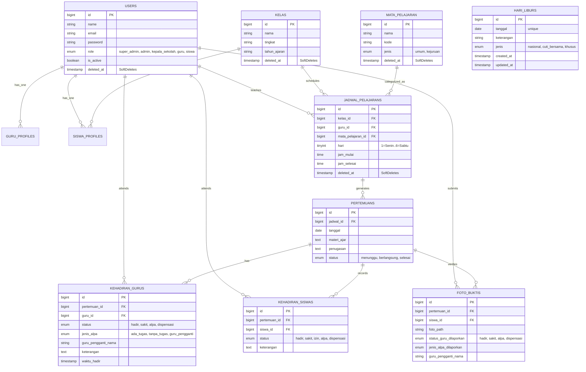

# Cetak Biru Basis Data & Diagram Relasi (ERD)

Dokumen ini mendokumentasikan skema tabel, relasi antar-entitas, dan kebijakan integritas data (*soft deletes* & *cascades*).

---

## 📊 Diagram Visual Entity-Relationship (Mermaid ERD)

---

## 🛡️ Kebijakan Integritas & Keamanan Data

1. **Soft Deletes**:
   - `users`: Siswa lulus atau guru mutasi tidak menghapus rekap kehadiran masa lampau.
   - `jadwal_pelajarans`: Pergantian semester / perubahan jadwal tidak menghapus jurnal mengajar sebelumnya.
   - `kelas` & `mata_pelajarans`: Mengamankan data master dari penghapusan tidak sengaja.
2. **Transaksi Database**:
   - Operasi penulisan kehadiran guru, siswa, dan materi wajib berada dalam lingkup transaksi atomik (`DB::transaction`).
3. **Validasi Anti-Bentrok Waktu**:
   - Jadwal dengan `hari` yang sama tidak boleh memiliki rentang waktu tumpang tindih untuk `guru_id` yang sama atau `kelas_id` yang sama.
