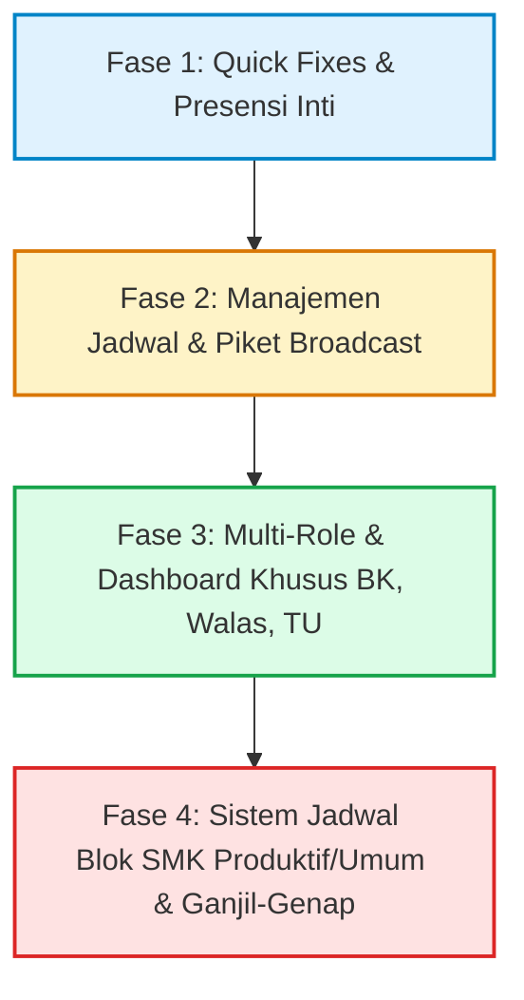

# Dokumen Perencanaan & Checklist Tugas (TASK.md)
## Sistem Agenda Mengajar Guru (SMK)

Dokumen ini memetakan 16 kebutuhan, perbaikan fungsional, fitur baru, dan keputusan arsitektural sistem ke dalam fase-fase terstruktur berbasis prioritas dan kompleksitas.

---

## 💡 Jawaban & Rekomendasi Terhadap Pertanyaan Desain

### 1. Pertanyaan Poin 4: *Apakah di landing page harus ditambahkan card untuk siswa seperti yang guru?*
- **Klarifikasi Kebutuhan:** Yang dimaksud adalah **Card KPI Ringkasan Statistik Siswa**, serupa dengan 4 card metrik statistik guru yang sudah ada di landing page.
- **Desain & Implementasi yang Disepakati:**
  Menambahkan deretan 4 card metrik statistik siswa di landing page publik berdampingan/sejajar dengan card statistik guru:
  1. **Total Siswa Hadir** (🟢 Jumlah siswa hadir di KBM hari ini)
  2. **Total Siswa Terlambat** (🟠 Jumlah siswa terlambat hari ini)
  3. **Total Siswa Alpa / Tidak Hadir** (🔴 Jumlah siswa alpa/izin/sakit hari ini)
  4. **Total Siswa yang Ada** (👥 Total seluruh siswa aktif terdaftar / terjadwal)

### 2. Pertanyaan Poin 9: *Apakah di piket akan bagus jika ada broadcast ke guru-guru yang statusnya belum hadir?*
- **Rekomendasi: SANGAT BAGUS (High Value Feature) & sangat relevan dengan operasional nyata guru piket.**
  - Di sekolah, tugas utama guru piket saat bel KBM berbunyi adalah menertibkan dan mengingatkan guru yang belum masuk kelas.
  - **Implementasi Efektif (Tanpa Biaya SMS Gateway / Pihak Ketiga):**
    Sediakan tombol aksi cepat **"Panggil Guru (WhatsApp)"** di setiap card guru yang berstatus *Belum Hadir* di dashboard piket.
    Ketika diklik, langsung membuka WhatsApp Web / App (`https://wa.me/628xxx?text=...`) dengan template otomatis:
    > *"Yth. Bpk/Ibu [Nama Guru], jadwal mengajar Anda di kelas [11 RPL 1] mata pelajaran [Pemrograman Web] jam ke-2 sudah dimulai. Mohon segera memasuki ruang kelas. Terima kasih - Tim Piket [Nama Sekolah]"*

---

## 🗺️ Peta Jalan & Rencana Fase Pengembangan



---

## 📌 FASE 1: Quick Fixes & Penyempurnaan Presensi (Prioritas Tinggi)
Fase ini berfokus pada perbaikan bug visual, penyempurnaan alur presensi harian, dan akurasi data yang langsung dirasakan pengguna.

### [x] Task 1.1: Standarisasi Dropdown Jam Pelajaran di Dashboard Awal / Piket (Poin 1)
- **Masalah:** Dropdown jam di dashboard saat ini mengelompokkan jam berdasarkan rentang `jam_mulai` - `jam_selesai` unik acak dari data jadwal, bukan urutan baku jam pelajaran sekolah (Jam ke-1, Jam ke-2, dst).
- **Rencana Pengerjaan:**
  - [x] Buat master/konfigurasi waktu slot jam pelajaran standar sekolah (misal: Jam 1: 07.00–07.45, Jam 2: 07.45–08.30, Istirahat: 09.45–10.15, dst).
  - [x] Perbarui `Piket/DashboardController` dan `KepalaSekolah/DashboardController` agar melakukan pemetaan jadwal ke nomor jam pelajaran standar.
  - [x] Pastikan slot aktif saat ini (`currentActiveSlotIndex`) otomatis terpilih saat halaman pertama kali dibuka berdasarkan `now()`.

### [x] Task 1.2: Logika Toleransi Keterlambatan Guru (5 - 7 Menit) (Poin 2)
- **Masalah:** Belum ada acuan baku batas toleransi menit sebelum guru ditandai sebagai *Terlambat*.
- **Rencana Pengerjaan:**
  - [x] Tambahkan konfigurasi waktu toleransi (default: 7 menit) di `config/agenda.php` atau konstanta model.
  - [x] Pada alur pelaporan siswa (`CaptureController`) & kehadiran guru:
    - Jika waktu hadir $\le$ `jam_mulai + 7 menit` $\rightarrow$ Status: `hadir` (🟢).
    - Jika waktu hadir $>$ `jam_mulai + 7 menit` $\rightarrow$ Status: `terlambat` (🟠).
  - [x] Tampilkan keterangan waktu terlambat di dashboard piket (misal: *"Terlambat 12 menit"*).

### [x] Task 1.3: Keterangan / Alasan Khusus Saat Siswa Izin / Sakit (Poin 3)
- **Masalah:** Saat guru mengabsen siswa "Izin" atau "Sakit", tidak ada tempat mencatat alasan (misal: "Dispen FLS2N", "Urusan Keluarga", "Rawat Inap").
- **Rencana Pengerjaan:**
  - [x] Buat migrasi penambahan kolom `keterangan` (nullable string/text) pada tabel `kehadiran_siswas`.
  - [x] Perbarui model `KehadiranSiswa` (`$fillable`).
  - [x] Pada view input agenda guru (`guru/pertemuan/show.blade.php`), tambahkan kolom/modal input catatan saat opsi status `izin` atau `sakit` dipilih.
  - [x] Tampilkan keterangan tersebut di rekapitulasi kehadiran siswa (Wali Kelas, BK, dan TU).

### [x] Task 1.4: Perbaikan Foto Bukti Siswa Broken / Tidak Muncul di Dashboard Guru (Poin 11)
- **Masalah:** Foto yang diunggah siswa saat capture tidak tampil di halaman pertemuan guru.
- **Rencana Pengerjaan:**
  - [x] Periksa disk penyimpanan di `CaptureController`: pastikan tersimpan di `disk('public')`.
  - [x] Perbaiki pemanggilan URL di Blade dari `Storage::url(...)` menjadi `Storage::disk('public')->url($foto->foto_path)` atau `asset('storage/' . $foto->foto_path)`.
  - [x] Verifikasi symlink publik server (`php artisan storage:link`) dan tambahkan pengecekan fallback jika file fisik belum terunggah/rusak.

### [x] Task 1.5: Rekalkulasi Persentase Kehadiran Berbasis Sesi Mapel (Bukan Harian) (Poin 10)
- **Masalah:** Persentase kehadiran dihitung per hari kerja, padahal di SMK kehadiran siswa dinilai per mata pelajaran yang diambil.
- **Rencana Pengerjaan:**
  - [x] Ubah rumus perhitungan rekap presensi siswa:
    $$\text{Tingkat Kehadiran Mapel (\%)} = \frac{\text{Total Hadir di Mapel X}}{\text{Total Pertemuan Mapel X yang Terlaksana}} \times 100\%$$
  - [x] Terapkan kalkulasi ini pada rekap agenda guru dan laporan siswa.

---

## 📌 FASE 2: Manajemen Jadwal, Leaderboard & Fitur Piket (Prioritas Menengah)
Fase ini berfokus pada kemudahan administrasi jadwal pelajaran dan alat pemantauan guru.

### [x] Task 2.1: Dropdown Export (PDF/Excel) & Fitur Import Jadwal dari Excel (Poin 8)
- **Kebutuhan:** Tombol export jadwal dijadikan dropdown (pilih PDF atau Excel), dan tambahkan fitur import jadwal dari file Excel (`.xlsx`).
- **Rencana Pengerjaan:**
  - [x] Ubah UI export di daftar jadwal admin menjadi split-button / dropdown:
    - *Opsi 1: Export PDF*
    - *Opsi 2: Export Excel (.xlsx)*
  - [x] Siapkan template Excel standar untuk import jadwal (Kolom: Hari, Tingkat, Kelas, Kode Mapel, NIP/Nama Guru, Jam Mulai, Jam Selesai).
  - [x] Buat tombol dan modal "Import Jadwal Excel" di halaman `admin/jadwal`.
  - [x] Implementasikan backend import dengan validasi:
    - Cek keberadaan kelas, guru, dan mapel.
    - Jalankan deteksi bentrok (*conflict detection*) otomatis saat import berlangsung.
    - Bungkus dalam `DB::transaction` agar jika ada baris yang bentrok/error, data tidak rusak parsial.

### [x] Task 2.2: Leaderboard Top Guru Terajin di Dashboard Admin (Poin 5)
- **Kebutuhan:** Menampilkan daftar peringkat guru yang paling rajin hadir. Jika ada keterlambatan atau alpa, persentase kehadiran berkurang.
- **Rencana Pengerjaan:**
  - [x] Buat query agregasi di `Admin/DashboardController`:
    $$\text{Skor Kehadiran} = \frac{\text{Pertemuan Hadir Tepat Waktu} + (0.5 \times \text{Terlambat})}{\text{Total Jadwal Mengajar}} \times 100\%$$
  - [x] Desain widget leaderboard modern di dashboard admin dengan:
    - Avatar guru & gelar
    - Badge persentase kehadiran (misal: 98.5%)
    - Rincian ringkas (Hadir: X, Terlambat: Y, Izin/Sakit: Z)
    - Indikator medali/peringkat (Top 5 / Top 10).

### [x] Task 2.3: Fitur Panggil / Broadcast Guru Belum Hadir di Dashboard Piket (Poin 9)
- **Kebutuhan:** Membantu guru piket menghubungi guru yang belum masuk kelas secara instan.
- **Rencana Pengerjaan:**
  - [x] Pastikan data nomor telepon/WhatsApp guru tersedia di `guru_profiles.no_hp` / `users.telepon`.
  - [x] Pada card monitoring guru piket berstatus "Belum Hadir", tambahkan tombol aksi hijau: **"Panggil Guru (WA)"**.
  - [x] Generate URL `https://wa.me/{no_hp}?text={template_pesan_terformat}`.
  - [x] Tambahkan modal konfirmasi atau daftar broadcast jika ingin memanggil seluruh guru yang terlambat sekaligus dalam satu klik.

---

## 📌 FASE 3: Multi-Role & Dashboard Khusus Pengguna (Prioritas Strategis)
Fase ini memperluas sistem otorisasi dan menyediakan antarmuka khusus sesuai peran struktural di sekolah.

### [x] Task 3.1: Manajemen Hak Akses & Role di Sisi Admin (Poin 16)
- **Kebutuhan:** Admin dapat mengatur dan menugaskan role secara fleksibel dari dashboard admin.
- **Rencana Pengerjaan:**
  - [x] Dukung daftar role lengkap di sistem: `super_admin`, `admin`, `kepala_sekolah`, `guru`, `piket`, `bk`, `tu`, `siswa`.
  - [x] Buat antarmuka di manajemen user admin untuk mengubah role, status aktif, dan penugasan khusus (penugasan kelas wali kelas, penugasan tingkat BK).
  - [x] Pasang middleware otorisasi yang ketat untuk setiap rute dashboard baru.

### [x] Task 3.2: Dashboard Guru BK (Bimbingan Konseling) (Poin 12)
- **Kebutuhan:** Guru BK dapat memantau presensi siswa sesuai angkatan/kelas binaan yang dipegangnya.
- **Rencana Pengerjaan:**
  - [x] Tambahkan relasi/tabel penugasan Guru BK ke tingkat atau daftar kelas tertentu (`bk_kelas_assignments` atau array kelas binaan).
  - [x] Buat rute dan controller `App\Http\Controllers\BK\DashboardController`.
  - [x] Tampilkan fitur di dashboard BK:
    - *Early Warning System:* Daftar siswa dengan alpa $\ge 3$ kali dalam sebulan.
    - Filter berdasarkan kelas binaan.
    - Riwayat detail ketidakhadiran per mata pelajaran beserta keterangan/alasan siswa.
    - Catatan/tindak lanjut penanganan kasus siswa oleh BK.

### [x] Task 3.3: Dashboard Khusus Wali Kelas di Sisi Guru (Poin 13)
- **Kebutuhan:** Guru yang ditugaskan sebagai wali kelas memiliki menu dashboard tersendiri untuk mengontrol kelasnya.
- **Rencana Pengerjaan:**
  - [x] Manfaatkan relasi `Kelas::where('wali_kelas_id', $user->id)`.
  - [x] Tambahkan navigasi "Kelas Perwalian Saya" di sidebar/header guru jika `user` terdaftar sebagai wali kelas.
  - [x] Fitur Dashboard Wali Kelas:
    - Rekapitulasi absensi harian dan per-mapel seluruh siswa di kelasnya.
    - Grafik tren kehadiran kelas bulanan.
    - Notifikasi jika ada siswa kelasnya yang tidak hadir berturut-turut.
    - Ekspor rekap presensi kelas (Excel & PDF) untuk laporan kenaikan kelas.

### [x] Task 3.4: Data Isolation: Dashboard Guru Khusus Siswa yang Diajar (Poin 14)
- **Kebutuhan:** Guru biasa hanya dapat melihat daftar presensi dan data siswa dari kelas dan mata pelajaran yang diampunya saja.
- **Rencana Pengerjaan:**
  - [x] Audit query rekap siswa di sisi guru (`Guru\ReportController` / `SiswaController`).
  - [x] Kunci scope data menggunakan `whereHas('jadwalPelajarans', fn($q) => $q->where('guru_id', $user->id))`.
  - [x] Cegah guru mengakses agenda atau data siswa dari kelas lain yang tidak diajarnya.

### [x] Task 3.5: Dashboard Tata Usaha (TU) untuk Rekapitulasi Presensi Siswa (Poin 15)
- **Kebutuhan:** Staf TU membutuhkan akses cepat untuk mencetak dan mengunduh rekap presensi seluruh siswa sekolah tanpa hak mengedit materi KBM.
- **Rencana Pengerjaan:**
  - [x] Buat rute dan controller `App\Http\Controllers\TU\DashboardController`.
  - [x] Fitur Dashboard TU:
    - Rekap presensi siswa tingkat sekolah (Harian, Mingguan, Bulanan, Semesteran).
    - Filter fleksibel: Berdasarkan Jurusan, Tingkat (X, XI, XII), Kelas, dan Rentang Tanggal.
    - Export massal format Dapodik / Dinas Pendidikan (Excel `.xlsx`).

### [x] Task 3.6: Card KPI Ringkasan Statistik Presensi Siswa di Landing Page (Poin 4)
- **Kebutuhan:** Menampilkan deretan 4 Card KPI Statistik Siswa di Landing Page / Public Dashboard, selevel dan sejajar dengan 4 Card KPI Guru yang sudah ada.
- **Rencana Pengerjaan:**
  - [x] Tambahkan kalkulasi agregat di `HomeController` / `PublicDashboardController`:
    - `siswa_hadir_hari_ini`: Total siswa dengan status presensi `hadir` pada pertemuan hari ini.
    - `siswa_terlambat_hari_ini`: Total siswa dengan status `terlambat` hari ini.
    - `siswa_alpa_hari_ini`: Total siswa dengan status `alpa` (atau `izin`/`sakit`) hari ini.
    - `total_siswa`: Total siswa aktif terdaftar di sekolah.
  - [x] Tambahkan grid 4 Card KPI Siswa di `public-dashboard.blade.php`:
    - 🟢 **Card Siswa Hadir:** Ikon check-circle / siswa, total angka, label "Siswa Hadir".
    - 🟠 **Card Siswa Terlambat:** Ikon clock / terlambat, total angka, label "Siswa Terlambat".
    - 🔴 **Card Siswa Alpa / Tidak Hadir:** Ikon x-circle, total angka, label "Siswa Alpa / Izin".
    - 👥 **Card Total Siswa:** Ikon user-group, total angka, label "Total Seluruh Siswa".

---

## 📌 FASE 4 (TERPISAH & PALING AKHIR): Sistem Jadwal Blok SMK (Kelompok A/B — Produktif vs Umum) (Poin 6 & 7)
> [!WARNING]
> **Tingkat Kesulitan: Sangat Tinggi (High Architectural Complexity).**  
> Sistem blok mengubah struktur dasar jadwal KBM dari mingguan statis menjadi rotasi berbasis siklus kelompok (Kelompok A / Kelompok B) yang dikonfigurasi oleh admin. Seluruh modul jadwal, validasi bentrok, kalender pertemuan, dan monitoring harian akan terpengaruh. Dikerjakan setelah Fase 1, 2, dan 3 stabil.

---

### 📚 Klasifikasi Mata Pelajaran

Sistem blok membagi mata pelajaran menjadi 2 kelompok:

| Kelompok | Jenis | Daftar Mata Pelajaran |
|---|---|---|
| **Kelompok A** | Mata Pelajaran Umum / Normatif | PAI, PKN, BAHASA, PJOK, SENI, SEJARAH, MATEMATIKA, IPAS |
| **Kelompok B** | Mata Pelajaran Produktif / Kejuruan | INFORMATIKA, KKA, DPK, KK, PKK, MAPIL |

> **Catatan:** Daftar mapel ini bersifat *seed data* di database (tabel `mata_pelajarans` dengan kolom `kelompok_blok`), dan dapat diubah oleh admin dari dashboard.

---

### 🔄 Dua Model Rotasi yang Didukung

#### Model 1: Rotasi Antar-Minggu (Per Kelas)
- Sebuah kelas memiliki **jadwal Kelompok A** di minggu tertentu dan **jadwal Kelompok B** di minggu berikutnya, bergantian.
- Setiap kelas bisa punya **titik awal berbeda** (ada yang mulai dari Kelompok A, ada yang mulai dari Kelompok B), ditentukan admin.
- Contoh:
  - Minggu ke-1: Kelas XI RPL 1 → **Kelompok B** (Produktif), Kelas XI RPL 2 → **Kelompok A** (Umum).
  - Minggu ke-2: Kelas XI RPL 1 → **Kelompok A** (Umum), Kelas XI RPL 2 → **Kelompok B** (Produktif).

#### Model 2: Split Dalam Sehari (Per Kelas, Sub-Kelompok Siswa)
- Di beberapa jurusan, **dalam 1 kelas dibagi 2 sub-kelompok siswa** yang berjalan bersamaan di hari yang sama:
  - Sub-kelompok 1 → Ruang Lab (Produktif / Kelompok B).
  - Sub-kelompok 2 → Ruang Kelas (Umum / Kelompok A).
- Kedua sub-kelompok berotasi di hari berikutnya.

---

### 🏗️ Rencana Arsitektur & Pengerjaan Teknis

#### [x] Task 4.1: Konfigurasi Kelas Sistem Blok oleh Admin

Admin menentukan kelas mana saja yang menggunakan sistem blok (kelas lain tetap reguler).

- [x] Tambahkan kolom pada tabel `kelas`:
  - `is_sistem_blok` (boolean, default: `false`) — apakah kelas ini pakai rotasi blok.
  - `model_rotasi` (enum: `['rotasi_minggu', 'split_harian']`) — model rotasi yang dipakai.
  - `blok_awal` (enum: `['kelompok_a', 'kelompok_b']`) — titik awal rotasi kelas ini.
- [x] Tambahkan UI di halaman manajemen kelas admin (toggle aktifkan sistem blok, pilih model & blok awal).

#### [x] Task 4.2: Skema Database Kalender Blok Mingguan

- [ ] Buat tabel `kalender_blok_minggu`:
  - `id`
  - `tanggal_mulai` (date) — Senin minggu tersebut.
  - `tanggal_selesai` (date) — Jumat/Sabtu minggu tersebut.
  - `nomor_minggu` (integer, urut dari awal semester).
  - `label` (string, misal: "Minggu ke-3 Semester Ganjil 2025/2026").
  - `timestamps`
- [ ] Admin dapat membuat/generate kalender blok dari awal hingga akhir semester via form atau auto-generate.
- [ ] Tambahkan kolom pada tabel `mata_pelajarans`:
  - `kelompok_blok` (enum: `['kelompok_a', 'kelompok_b', 'reguler']`, default: `reguler`) — mapel non-blok tetap `reguler`.
- [ ] Tambahkan kolom pada tabel `jadwal_pelajarans`:
  - `kelompok_blok` (enum: `['kelompok_a', 'kelompok_b', 'reguler']`, default: `reguler`) — mewarisi dari mapel, bisa di-override.

#### [x] Task 4.3: Logic Resolver — Jadwal Aktif Hari Ini

Buat `App\Services\JadwalBlokResolverService` dengan tanggung jawab:

1. Terima parameter: **tanggal hari ini** dan **ID kelas**.
2. Cek apakah kelas tersebut `is_sistem_blok = true`.
   - Jika **tidak** → kembalikan semua jadwal `kelompok_blok = 'reguler'` kelas tersebut (perilaku normal).
3. Jika **iya**, cari minggu aktif di `kalender_blok_minggu` berdasarkan tanggal hari ini.
4. Hitung kelompok aktif kelas ini minggu ini:
   ```
   $offsetMinggu = $nomor_minggu - 1; // 0-indexed
   $kelompokAktif = ($offsetMinggu % 2 === 0) ? $blok_awal : kelompok_lainnya($blok_awal);
   ```
5. Ambil jadwal dengan filter: `kelompok_blok IN ('reguler', $kelompokAktif)`.
6. Untuk **Model Split Harian**: kembalikan jadwal semua sub-kelompok (Kelompok A **DAN** Kelompok B) karena keduanya berjalan paralel — bedakan via `sub_kelompok_siswa`.

- [ ] Integrasikan `JadwalBlokResolverService` ke seluruh controller yang memuat jadwal hari ini:
  - `Piket\DashboardController`
  - `KepalaSekolah\DashboardController`
  - `Guru\AgendaController`
  - `Siswa\DashboardController`

#### [x] Task 4.4: Pembaruan Validasi Bentrok Jadwal

- [ ] Sesuaikan `Admin\JadwalController` & `JadwalStoreRequest`:
  - Jadwal `kelompok_a` dan `kelompok_b` di kelas yang sama **tidak bentrok satu sama lain** (karena tidak aktif bersamaan dalam minggu yang sama — Model Rotasi Minggu).
  - Untuk Model Split Harian: jadwal `kelompok_a` dan `kelompok_b` di jam yang sama **tetap valid** (karena menggunakan ruangan berbeda).
  - Bentrok tetap terjadi jika: **guru yang sama** dijadwalkan di 2 kelas berbeda di jam yang sama pada kelompok yang sama.

#### [x] Task 4.5: UI Form Jadwal — Pilihan Kelompok Blok

- [ ] Tambahkan field `Kelompok Blok` pada form tambah/edit jadwal admin:
  - Dropdown: `Reguler` / `Kelompok A (Umum)` / `Kelompok B (Produktif)`.
  - Secara default, nilai diambil dari `mata_pelajaran.kelompok_blok`.
- [ ] Tampilkan badge di tabel daftar jadwal: `[Reguler]`, `[Kel. A]`, `[Kel. B]`.
- [ ] Tampilkan badge di monitoring piket & dashboard: `📘 Kelompok A` / `🔧 Kelompok B`.

#### [x] Task 4.6: Halaman Kalender Blok Admin

- [ ] Buat halaman `admin/kalender-blok` untuk mengelola `kalender_blok_minggu`:
  - Tampilkan tabel minggu dengan kolom: Nomor Minggu, Tanggal Mulai, Tanggal Selesai, Label.
  - Tombol **"Generate Otomatis"** — admin input tanggal mulai semester + jumlah minggu → sistem auto-fill semua baris.
  - Admin dapat melihat simulasi: "Minggu ini, Kelas XI RPL 1 aktif Kelompok **B**".

#### [x] Task 4.7: Tampilan Dashboard — Indikator Blok Aktif

- [ ] Di dashboard piket & kepala sekolah, tampilkan banner informasi hari ini:
  > 📅 **Minggu ke-5** — Kelas XI RPL 1: **Kelompok B (Produktif)** | Kelas XI RPL 2: **Kelompok A (Umum)**
- [ ] Di dashboard guru, jika minggu ini bukan giliran kelas yang diajar → tampilkan notifikasi:
  > 🔔 *"Kelas XI RPL 2 — Matematika tidak aktif minggu ini (Kelompok B). Jadwal Anda aktif kembali minggu depan."*

---

### ⚠️ Catatan Penting Implementasi

> [!IMPORTANT]
> **Urutan pengerjaan Fase 4 yang disarankan:** Task 4.1 → 4.2 → 4.3 → 4.6 → 4.4 → 4.5 → 4.7.  
> Task 4.3 (Resolver Service) adalah inti dari seluruh sistem — semua fitur lain bergantung padanya.

> [!CAUTION]
> Jika ada data jadwal lama yang sudah ada sebelum sistem blok diterapkan, semua baris lama harus di-migrate dengan nilai `kelompok_blok = 'reguler'` agar tidak mempengaruhi kelas-kelas yang tidak menggunakan sistem blok.

---

## 📊 Matriks Ketergantungan & Urutan Eksekusi

| No | Komponen / Fitur | Target Fase | Estimasi Tingkat Kesulitan | Ketergantungan (*Prerequisite*) |
|---|---|---|---|---|
| 1 | Dropdown Jam Standar | Fase 1 | Rendah | Tidak ada |
| 2 | Toleransi Keterlambatan 5-7 Menit | Fase 1 | Rendah | Tidak ada |
| 3 | Keterangan Izin/Sakit Siswa | Fase 1 | Rendah | Migrasi `kehadiran_siswas` |
| 4 | Fix Foto Bukti Broken di Guru | Fase 1 | Rendah | Storage config / symlink |
| 5 | Persentase Hadir per-Mapel | Fase 1 | Sedang | Perhitungan query |
| 6 | Export Dropdown & Import Excel | Fase 2 | Sedang | Library Excel / Maatwebsite |
| 7 | Leaderboard Top Guru di Admin | Fase 2 | Sedang | Query agregasi kehadiran |
| 8 | Broadcast WA Guru Belum Hadir | Fase 2 | Rendah - Sedang | Data No HP Guru |
| 9 | Manajemen Role Dinamis Admin | Fase 3 | Sedang | Middleware & User CRUD |
| 10 | Dashboard BK | Fase 3 | Sedang | Role BK & Penugasan Kelas |
| 11 | Dashboard Wali Kelas | Fase 3 | Sedang | Relasi `wali_kelas_id` |
| 12 | Isolasi Data Siswa per Guru | Fase 3 | Sedang | Query Scoping |
| 13 | Dashboard TU Rekap Siswa | Fase 3 | Sedang | Role TU & Report View |
| 14 | Evaluasi Landing Page Siswa | Fase 3 | Rendah | Ringkasan Statistik |
| 15 | **Sistem Blok SMK (Produktif/Umum)** | **Fase 4** | **Sangat Tinggi** | **Fase 1, 2, & 3 selesai stabil** |
| 16 | **Rotasi Jadwal Ganjil/Genap** | **Fase 4** | **Sangat Tinggi** | **Task 15 (Sistem Blok)** |

---

*Dokumen ini diperbarui secara berkala seiring berjalannya implementasi kode.*
